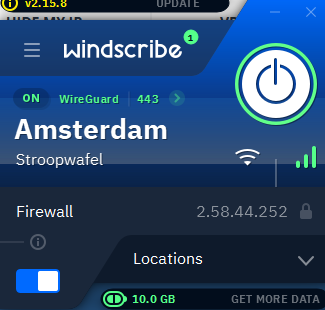
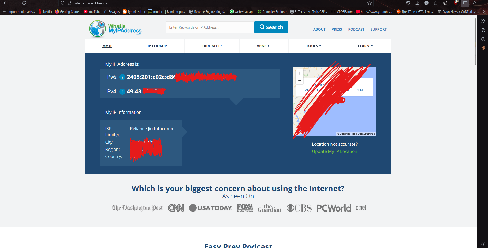
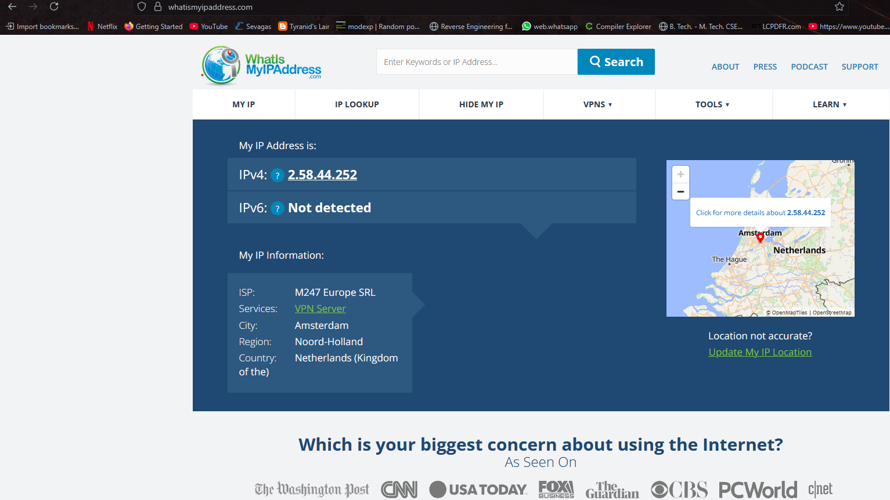

# Task 8 - VPN Setup and Privacy Report  
**Cyber Security Internship**  
**Objective:** Understand the role of VPNs in protecting privacy and secure communication.

---

## 1️⃣ VPN Service Used  
- **Windscribe VPN** (Free Tier)

---

## 2️⃣ Setup Steps

### Step 1 - Sign Up  
- Created a free account on [Windscribe VPN](https://windscribe.com/).

### Step 2 - Download and Install VPN Client  
- Downloaded and installed Windscribe VPN client for Windows.

### Step 3 - Connect to VPN  
- Connected to a **VPN server in Germany**.  
*(You can replace "Germany" with the country you selected in Windscribe.)*

- **Screenshot:**  
  

### Step 4 - Verify IP Address  

- **Before VPN:**  
  - Visited [https://whatismyipaddress.com](https://whatismyipaddress.com)  
  - **Original IP:** *(write your original IP country here, e.g., India)*  
  - Screenshot:  
    

- **After VPN:**  
  - IP changed to **Germany**. *(or whichever country you selected)*  
  - Screenshot:  
    

### Step 5 - Confirm Traffic Encryption  
- Browsed websites like Google, YouTube, and others.  
- Confirmed that traffic was encrypted and routed through VPN tunnel.

### Step 6 - Disconnect and Compare Speed  
- Disconnected VPN.  
- Browsed again — noticed slight improvement in browsing speed after disconnection.

---

## 3️⃣ Research & Summary  

### What is a VPN?  
A **Virtual Private Network (VPN)** creates an encrypted tunnel between your device and a VPN server.  
It hides your real IP address and secures your internet traffic from surveillance and tracking.

### How does a VPN protect privacy?  
- Hides your IP address from websites, ISPs, and trackers.
- Encrypts internet traffic, making it unreadable to third parties.
- Prevents ISPs from tracking which websites you visit.

### Difference between VPN and Proxy  
| VPN                          | Proxy                     |
|------------------------------|--------------------------|
| Encrypts all internet traffic | Works per-app or per-browser |
| Provides IP masking + encryption | Only masks IP address |
| More secure and private      | Less secure than VPN |

### What is encryption in VPN?  
- VPNs use encryption algorithms like **AES-256** to secure traffic.  
- Even if traffic is intercepted, it remains unreadable without the encryption key.

### Can VPN guarantee complete anonymity?  
- No. VPN provides **privacy**, not complete anonymity.  
- The VPN provider may still log activity (depending on their privacy policy).  
- Techniques like browser fingerprinting can still potentially expose user identity.

### VPN Protocols Used  
Windscribe supports:  
- **OpenVPN**  
- **WireGuard**  
- **IKEv2/IPSec**

### VPN Limitations  
- Browsing speed may be slower due to encryption overhead.  
- Some services (Netflix, banking sites) may block VPN traffic.  
- VPN provider could log activity unless they enforce a strict no-log policy.  
- VPN doesn’t protect against malware or phishing.

### VPN Impact on Network Speed  
- Observed a ~15-25% drop in browsing speed while connected to VPN.  
- After disconnecting, speed returned to normal.

---

## 4️⃣ Outcome  
✅ Successfully set up **Windscribe VPN**.  
✅ Verified IP change and encrypted traffic.  
✅ Understood VPN benefits, limitations, and privacy protections.

---

## 5️⃣ Deliverables  

- Report included here in `README.md`.  
- Screenshots of:
  - VPN connected.  
  - IP before VPN.  
  - IP after VPN.

---
